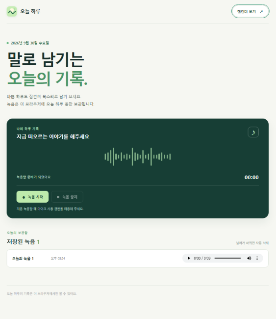
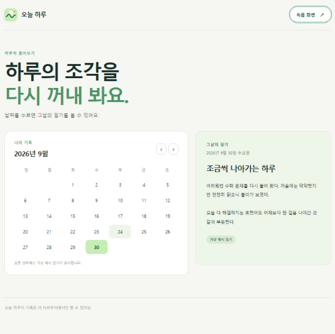

# 오늘 하루

브라우저에서 목소리로 하루를 기록하는 임시 웹 버전입니다. 현재는 녹음을 당일에 보관하고 재생할 수 있으며, 캘린더에서 날짜별 **가상 예시 일기**를 볼 수 있습니다.

## 화면 미리보기

### 녹음 화면

마이크로 녹음한 뒤 중지하면 당일 녹음이 아래 목록에 나타나며 재생할 수 있습니다.

### 캘린더 화면

캘린더에서 날짜를 누르면 오른쪽에 그날의 **가상 예시 일기**가 표시됩니다. 사진 속 일기는 녹음에서 생성된 내용이 아닙니다.

## 실행 방법

빌드 도구, 서버, 프레임워크 설치 없이 프로젝트의 `index.html`을 브라우저에서 직접 엽니다.

- Windows: 파일 탐색기에서 `index.html`을 열거나, 프로젝트 폴더의 터미널에서 `start index.html`을 실행합니다.
- macOS: 파일을 브라우저에서 열거나, 프로젝트 폴더의 터미널에서 `open index.html`을 실행합니다.
- 코드를 고친 뒤에는 브라우저에서 새로고침합니다(Windows F5 / macOS Cmd+R).

녹음하려면 브라우저의 마이크 접근을 허용해야 합니다. 브라우저 환경에 따라 로컬 파일에서 마이크 사용이나 저장소 접근이 제한될 수 있습니다. 녹음이 시작되지 않으면 화면의 안내 문구와 브라우저 권한 설정을 확인하세요.

## 파일 구성

| 경로 | 역할 |
| --- | --- |
| `index.html` | 녹음 화면과 캘린더 화면의 구조 |
| `style.css` | 화면 디자인과 반응형 배치 |
| `app.js` | 녹음, 브라우저 내부 오디오 저장, 날짜 변경 시 오디오 정리, 캘린더 표시 |
| `docs/plan.md` | 제품 범위와 사용 흐름을 정리한 기획서 |
| `docs/prompt-design.md` | 구현 제약과 상세 완료 기준 |
| `docs/env-check.md` | 실습 환경 확인 목록 |
| `docs/loop-log.md` | 사람의 검증 결과와 수정 이력을 기록할 표 |
| `docs/images/` | README에 표시하는 녹음 화면과 캘린더 화면 사진 |
| `AGENTS.md` | 저장소 작업 지침 |

현재 웹 화면은 루트의 HTML·CSS·JavaScript 파일로 구성되며, 테스트나 웹 화면용 이미지 자산 디렉터리는 없습니다. 자동 테스트, 포맷, 빌드 명령어도 설정되어 있지 않습니다.

## 현재 사용 흐름

1. **녹음 시작**을 누르고 마이크 접근을 허용합니다.
2. **녹음 중지**를 누릅니다. 저장된 오디오는 화면 아래 목록에서 재생할 수 있습니다.
3. **캘린더 보기**를 누르고 날짜를 선택하면 해당 날짜의 가상 예시 일기가 표시됩니다.

녹음 파일은 이 브라우저의 IndexedDB에 저장됩니다. 페이지를 열거나 다시 활성화했을 때, 그리고 화면이 열린 동안 주기적으로 날짜를 확인해 지난날의 녹음을 삭제합니다. 브라우저 저장소를 지우면 녹음도 사라집니다.

## 아직 구현되지 않은 기능

- 당일 녹음 내용을 분석해 **오늘의 일기**를 생성하는 기능
- 일기 수정·저장 및 새로고침 후 유지
- 저장한 일기를 날짜별로 조회하는 기능

현재 캘린더의 일기는 실제 녹음으로 생성하거나 저장한 내용이 아니라 가상의 예시입니다. 목표 동작과 완료 기준은 [기획서](docs/plan.md)와 [프롬프트 설계서](docs/prompt-design.md)를 참고하세요. 회원가입, 로그인, 서버, 공유 기능은 제품 범위에서 제외합니다.

## 브라우저에서 확인하기

1. `index.html`을 열고 개발자 도구 콘솔에 오류가 없는지 확인합니다.
2. 마이크를 허용한 뒤 녹음을 시작하고 중지해, 목록에 오디오가 나타나고 재생되는지 확인합니다.
3. 새로고침한 뒤에도 당일 녹음이 목록에 남는지 확인합니다.
4. 캘린더에서 다른 날짜와 달을 선택해 가상 예시 일기가 표시되는지 확인합니다.

일기 생성·수정·저장과 날짜별 저장 일기 조회는 구현된 뒤 [프롬프트 설계서의 완료 기준](docs/prompt-design.md#5-완료-기준)에 따라 추가로 확인해야 합니다.
