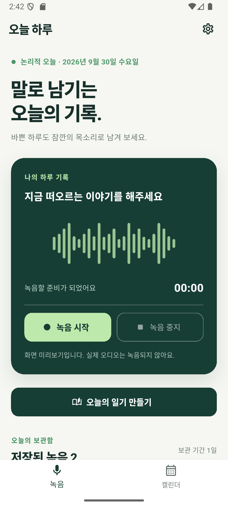
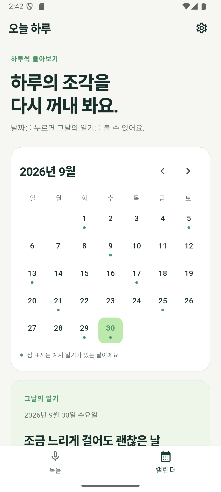
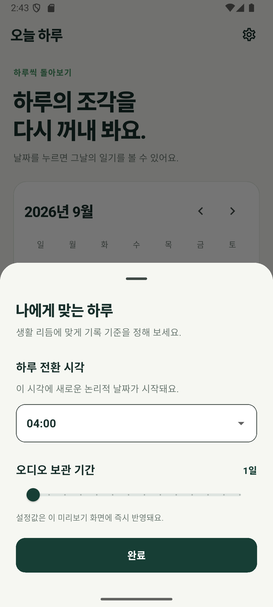
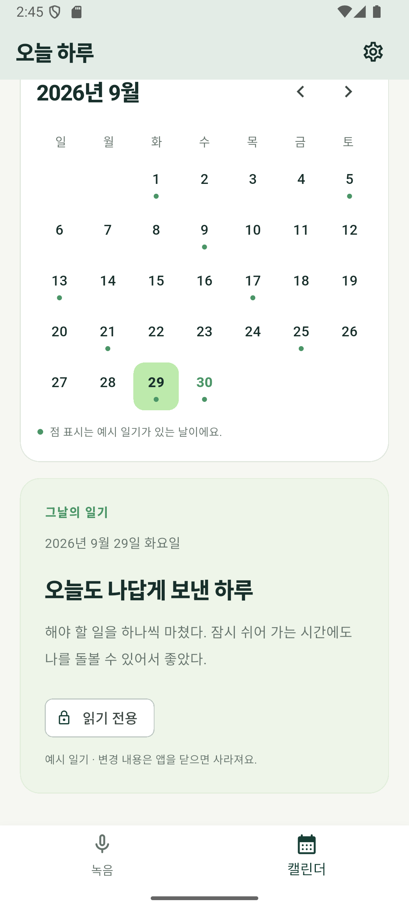

# 오늘 하루

목소리로 하루를 기록하고, 녹음을 바탕으로 만든 일기를 캘린더에서 돌아보는 **Flutter 모바일 앱**입니다. 회원가입·서버 없이 기기 안에서만 동작합니다.

현재는 **Android 로컬 저장 단계**입니다. 화면 전환, 논리적 날짜·보관 기간·당일 수정 잠금 정책, 마이크 권한 요청·녹음·재생·앱 내부 저장소 보관, 다운로드 폴더로 내보내기, 앱 실행 시 보관 기간이 지난 녹음 자동 삭제, 설정과 일기의 로컬 저장은 동작합니다. 일기 초안은 STT·AI 요약 대신 가상 문장(`MockDiaryGenerator`)으로 만듭니다. 녹음·재생·내보내기는 Android에서만 동작합니다.

## 화면 미리보기

Android 에뮬레이터에서 캡처한 화면입니다.

| 녹음 탭 | 캘린더 탭 | 설정 | 과거 일기(읽기 전용) |
| --- | --- | --- | --- |
|  |  |  |  |

- **녹음 탭:** 논리적 오늘 날짜, 녹음 카드(더미 파형·경과 시간·시작/중지), [오늘의 일기 만들기](오늘 녹음이 있을 때 가상 초안 일기를 저장), 녹음 보관함(저장된 녹음을 논리적 날짜별로 묶어 표시, 재생·정지와 진행 막대, 시스템 저장 창으로 내보내기)
- **캘린더 탭:** 월 이동, 저장된 일기가 있는 날짜에만 마커, 선택 날짜의 일기. 논리적 당일만 [수정] 가능하고 과거 날짜는 "읽기 전용"
- **설정 바텀시트:** 하루 전환 시각(21:00~익일 09:00), 오디오 보관 기간(1~14일). 변경 즉시 화면에 반영되고 앱을 다시 실행해도 유지

## 실행 방법

Flutter SDK(3.44 이상, Dart 3.12)와 Android 에뮬레이터 또는 실기기가 필요합니다. 환경 점검은 [docs/env-check.md](docs/env-check.md)를 참고하세요.

```bash
flutter pub get
flutter analyze
flutter test
flutter run
```

특정 테스트만 실행하려면 `flutter test test/domain/logical_date_service_test.dart`처럼 경로를 지정합니다.

## 파일 구성

| 경로 | 역할 |
| --- | --- |
| `lib/main.dart` | 앱 진입점. `TimeService` 주입 가능 |
| `lib/core/theme/app_theme.dart` | 앱 테마·색상 |
| `lib/core/services/time_service.dart` | `TimeService` 인터페이스, `SystemTimeService`, 테스트용 `FakeTimeService` |
| `lib/core/date_format.dart` | 날짜·전환 시각 표시 문자열 |
| `lib/domain/services/logical_date_service.dart` | 하루 전환 시각 기준 논리적 날짜 계산 |
| `lib/domain/policies/audio_retention_policy.dart` | 오디오 보관 기간 만료 판정(`isExpired`) |
| `lib/domain/policies/diary_policy.dart` | 당일 수정 잠금(`DiaryPolicy.canEdit`) |
| `lib/data/mock_diary_generator.dart` | 날짜별 결정론적 가상 일기 |
| `lib/data/recording_store.dart` | 앱 내부 저장소의 녹음 파일 경로 생성·목록 조회·삭제 |
| `lib/data/audio_cleanup_service.dart` | 앱 실행 시 보관 기간이 지난 녹음 삭제 |
| `lib/data/settings_store.dart` | 하루 전환 시각·오디오 보관 기간 설정 저장 |
| `lib/data/diary_store.dart` | 일기 로컬 저장(날짜별 JSON) |
| `lib/core/services/audio_recorder_service.dart` | 마이크 권한·녹음 계약과 Android MethodChannel 구현 |
| `lib/core/services/audio_player_service.dart` | 녹음 재생·내보내기 계약과 Android MethodChannel 구현 |
| `lib/presentation/screens/` | 메인 쉘, 녹음 탭, 캘린더 탭 |
| `lib/presentation/widgets/settings_sheet.dart` | 설정 바텀시트 |
| `test/domain/` | 논리적 날짜·보관 기간·수정 잠금 단위 테스트 하네스 |
| `test/core/services/` | `FakeTimeService` 동작 테스트 |
| `test/data/` | 녹음·설정·일기 저장소, 만료 삭제 테스트 |
| `test/presentation/` | 녹음 시작/중지·재생·내보내기·날짜별 보관함, 일기 생성·마커·재실행 후 유지, 당일 수정 위젯 테스트 |
| `test/helpers/fakes.dart` | 테스트용 가짜 녹음기·재생기·내보내기·메모리 저장소 |
| `test/widget_test.dart` | 탭 전환·설정 반영·읽기 전용 위젯 테스트 |
| `android/`, `ios/` | 플랫폼 프로젝트 |
| `docs/plan.md` | 제품 범위와 사용 흐름을 정리한 기획서 |
| `docs/prompt-design.md` | 구현 제약, 완료 기준, 하네스 테스트 시나리오 |
| `docs/env-check.md` | 모바일 실습 환경 확인 목록 |
| `docs/loop-log.md` | 사람의 검증 결과와 수정 이력을 기록할 표 |
| `docs/screenshots/` | 에뮬레이터 화면 캡처 |
| `AGENTS.md` | 저장소 작업 지침 |
| `Work_Log.md` | 작업 기록(로컬 전용, git 제외) |

## 구현 현황

| 완료 기준 | 상태 |
| --- | --- |
| 하루 전환 시각 기준 논리적 날짜 계산 | 완료. 보관함 날짜 묶음·오늘 녹음 판정·일기 날짜·만료 삭제에 적용 |
| 당일 수정 잠금 | 완료. 당일 수정 내용은 로컬에 저장 |
| 오디오 보관 기간 만료 삭제 | 완료. 앱 실행 시 저장된 보관 기간 기준으로 만료 녹음 영구 삭제(저장된 하루 전환 시각 기준) |
| 설정 화면 즉시 반영 | 완료. 하루 전환 시각·보관 기간 모두 앱 재시작 후에도 유지 |
| 마이크 권한·녹음·재생 | 완료(Android, 외부 패키지 없이 MethodChannel) |
| 오디오 다운로드/내보내기 | 완료. 시스템 저장 창(파일 앱, 기본 위치 다운로드 폴더)으로 저장. 다른 앱으로 공유는 미구현 |
| 일기 생성·저장, 캘린더 조회 | 완료. 오늘 녹음이 있으면 가상 초안 생성, 로컬 저장, 저장된 일기만 마커 표시 |

목표 동작과 완료 기준은 [기획서](docs/plan.md)와 [프롬프트 설계서](docs/prompt-design.md)를 참고하세요. 회원가입, 로그인, 서버, 공유 기능은 제품 범위에서 제외합니다.

## 기기에서 확인하기

1. `flutter run` 후 콘솔에 예외 로그가 없는지 확인합니다.
2. 녹음 탭 상단에 논리적 오늘 날짜가 표시되는지 확인합니다.
3. 설정에서 전환 시각과 보관 기간을 바꾸면 녹음 탭 날짜와 "보관 기간 N일" 표시가 즉시 바뀌는지 확인합니다.
4. 캘린더에서 오늘을 선택하면 [수정] 버튼이, 과거 날짜를 선택하면 "읽기 전용"이 표시되는지 확인합니다.
5. 스크롤 끝에서 당겨도 화면이 늘어나거나 번지는 오버스크롤 효과가 나타나지 않는지 확인합니다.
